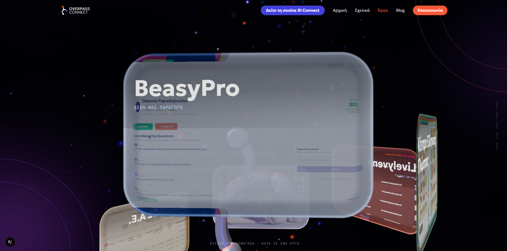

+++
title = "Overpass Connect"
description = "Εταιρικός ιστότοπος · R3F"
weight = 10

[extra]
status = "live"
banner = "banner.png"
+++

<ul class="facts">
<li><strong>Έτος</strong>2026</li>
<li><strong>Κατάσταση</strong>Σε λειτουργία</li>
<li><strong>Skills</strong>Σχεδιασμός, WebGL και front-end</li>
</ul>

Εταιρικός ιστότοπος με hero έναν βράχο από voxels φτιαγμένο από το ίδιο το CAD mesh του πελάτη, και σελίδα έργων όπου η κάμερα πετά κατά μήκος μιας έλικας από κάρτες. Κάθε ενότητα είναι επιφάνεια WebGL, όχι ορθογώνιο με μια φωτογραφία μέσα.

## Τεχνολογίες

- Next.js
- React Three Fiber
- GLSL
- Lenis

## Τι το έκανε ενδιαφέρον

- Η βάση είναι ένα instanced mesh με χρώματα και roots ανά instance που ξαναγράφονται κάθε καρέ — η πρώτη εκδοχή με ~350 ξεχωριστά meshes κόλλαγε.
- Στην κύλιση ο κόσμος σχίζεται σε δύο συμπαγείς πλάκες κατά μήκος μιας οδοντωτής ραφής, γέρνει, γλιστρά και βυθίζεται, αποκαλύπτοντας την επόμενη ενότητα από πίσω.
- Η σελίδα έργων είναι έλικα οδηγούμενη από την κύλιση: κλικ σε μια κάρτα και η κάμερα περνά μέσα από το γυαλί σε πλήρη παρουσίαση.

## Οθόνες

[Επισκεφθείτε τον ιστότοπο](https://overpassconnect.vercel.app)
