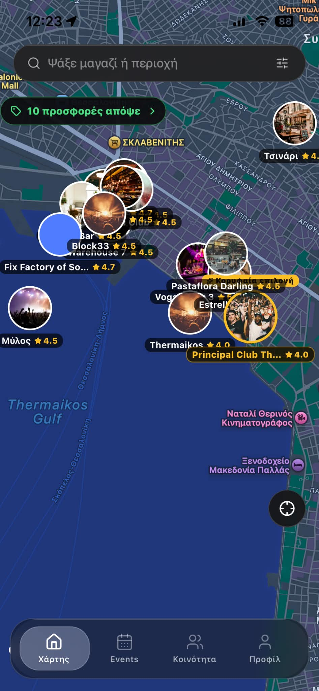
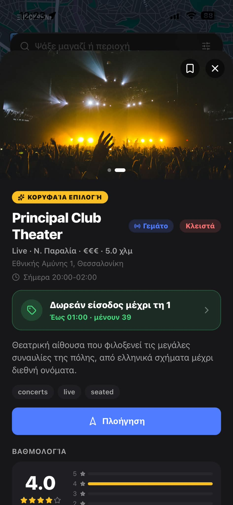
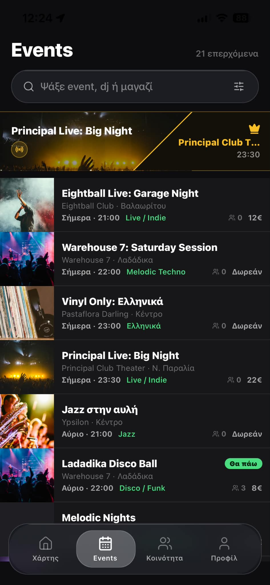
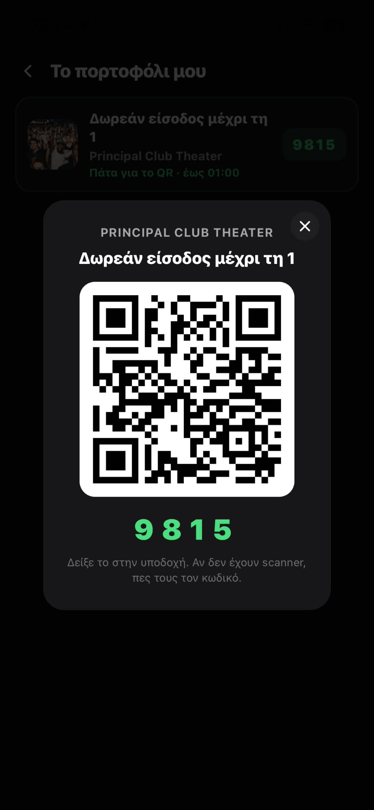
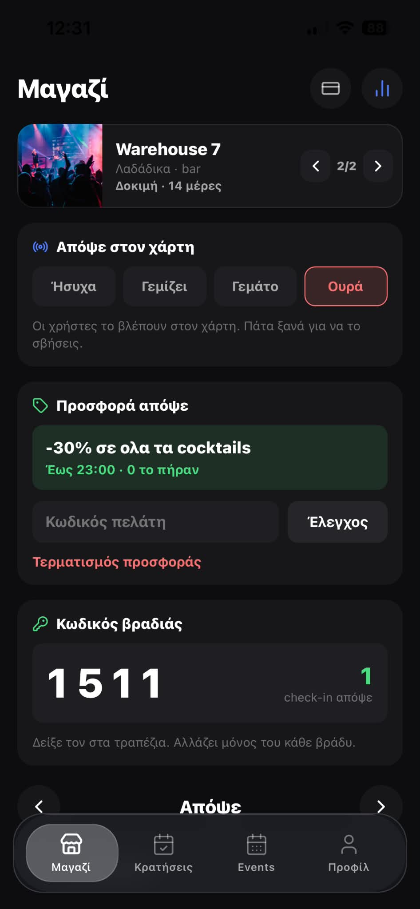
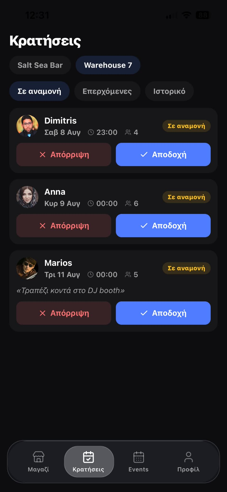

+++
title = "Vibeway"
description = "Εφαρμογή για κινητό γύρω από την έξοδο: χάρτης με μαγαζιά, ροή με events, φίλοι και μηνύματα."
weight = 20

[extra]
status = "soon"
banner = "banner.jpg"
+++

<ul class="facts">
<li><strong>Έτος</strong>2026</li>
<li><strong>Κατάσταση</strong>Σύντομα</li>
<li><strong>Ρόλος</strong>Σχεδιασμός και ανάπτυξη mobile</li>
</ul>

Εφαρμογή για κινητά γύρω από την έξοδο: χάρτης με μαγαζιά, ροή εκδηλώσεων από απόψε και μετά, γράφος φίλων με μηνύματα, και προφίλ που δένει τα τρία μεταξύ τους.

## Τι το έκανε ενδιαφέρον

- Πρώτα ο χάρτης, όχι η ροή: τα μαγαζιά είναι σημεία που ανοίγεις για φωτογραφίες, περιγραφή, βαθμολογίες και πλοήγηση.
- Οι εκδηλώσεις ξεκινούν από τώρα και μετά και φέρουν ό,τι κρίνει τη βραδιά: line-up, είδος μουσικής, ώρες και βαθμολογία του χώρου.
- Αιτήματα φιλίας, εγκρίσεις και απευθείας μηνύματα με φωτογραφίες, σε γράφο που συνδέει μόνο όταν συμφωνήσουν και οι δύο πλευρές.

## Οθόνες

[Επισκεφθείτε τον ιστότοπο](https://vibeway.gr)
